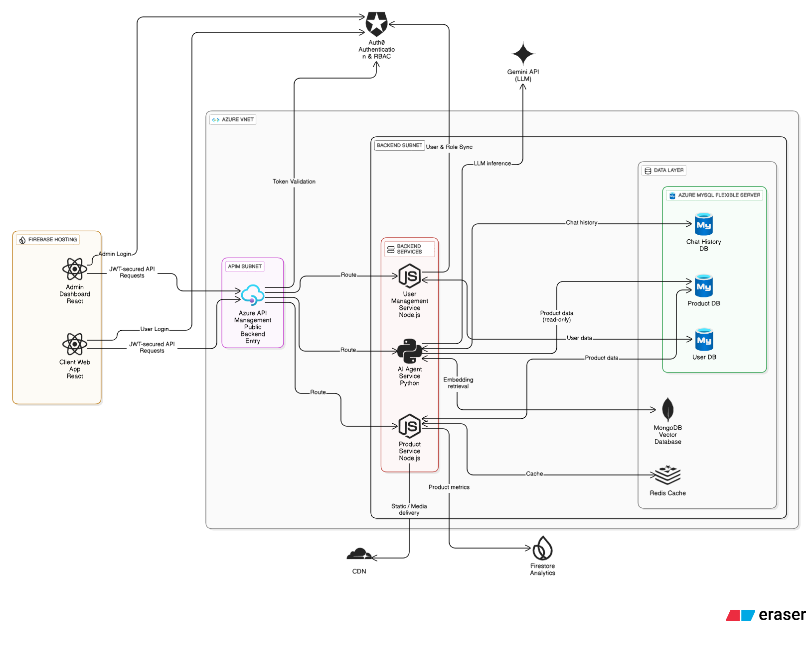

# FinVerse 🏦💼

**Your Intelligent Financial Companion for Smart Money Decisions**

🌐 **Live Application:** [https:finverse.com](https://finverselk.web.app/)

FinVerse is a **cloud-native, AI-powered financial marketplace** that connects users with financial institutions, enabling smart comparison, discovery, and decision-making across financial products through personalized insights.

---

## 🎯 What is FinVerse?

FinVerse is a **two-sided marketplace** designed for both consumers and financial institutions.

### 👤 For Users

* Compare financial products across multiple institutions
* Save and organize favorite products
* Share product comparisons with others
* Chat with an AI assistant for instant financial guidance
* Create user profiles for personalized recommendations

### 🏛️ For Financial Institutions

* List and manage financial products
* Showcase competitive rates and features
* Connect with qualified prospects
* Access analytics on product performance and engagement

---

## 🏗️ High-Level Architecture

* **Frontend:** Firebase-hosted React applications
* **Backend:** Azure-hosted microservices (Node.js & Python)
* **API Gateway:** Azure API Management (single public entry point)
* **Authentication:** Auth0 (OIDC + RBAC)
* **AI Layer:** RAG-based agent using Gemini + LangChain
* **Data:** Azure MySQL, Redis, MongoDB Vector DB
* **Networking:** Private Azure VNet with subnet isolation

---

## 🧱 Technology Stack

### **Frontend & UI**

### **Backend & APIs**

### **Databases & Messaging**

### **AI & ML**

### **Cloud & DevOps**

---

## 🚀 Key Features

### 💰 Smart Financial Product Comparison

* Loans, fixed deposits, credit cards, and banking services
* Institution-to-institution comparisons
* Personalized ranking based on user profile

---

### 🤖 AI-Powered Financial Assistant

* RAG-based AI chat assistant
* Product-aware recommendations
* Simplified explanations of complex financial products
* 24/7 availability

---

### 📊 Personal Financial Workspace

* Save and manage favorite products
* Create and share comparison lists
* Track research and decisions in one place

---

### 📈 Interest Rate Intelligence

* Monitor real-time interest rates
* Historical trend analysis
* Rate change alerts
* Best-rate recommendations

---

### 🏛️ Institutional Marketplace

* Product listing and management
* Customer engagement tools
* Performance and engagement analytics

---

## 🔐 Security & Access Control

* Auth0-based authentication (OIDC)
* JWT-secured APIs
* Role-based access control (User / Institution / Admin)
* Private backend services within Azure VNet
* Single public backend entry via Azure API Management

---

## 🏆 Why FinVerse?

* **All-in-one financial discovery platform**
* **AI-driven, personalized insights**
* **Enterprise-grade security**
* **Scalable microservice architecture**
* **User-friendly experience for all skill levels**

---

## 🏗️ Architecture Overview

FinVerse follows a secure, scalable, cloud-native microservices architecture with clear separation between frontend, API gateway, backend services, and data layers.

🔍 Key Architectural Principles

* **Single public backend entry point via Azure API Management**

* **Private backend services isolated within an Azure VNet**

* **Role-based authentication and authorization using Auth0**

* **Microservices per domain (User, Product, AI Agent)**

AI-first design using a RAG-based agent architecture

## 📐 System Architecture Diagram

The diagram below illustrates the complete FinVerse system architecture, including frontend hosting, API gateway, backend microservices, private networking, databases, and external services.

