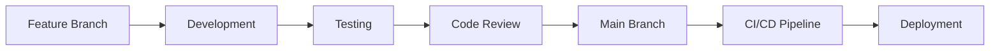

# FinVerse Banking Service API - Architecture Documentation

## 🏗️ System Architecture Overview

The FinVerse Banking Service API is a comprehensive microservice built with a modern, scalable architecture designed to handle financial product management, user interactions, and real-time analytics. This document provides a detailed view of the system's architecture, components, and data flow.

## 📊 High-Level Architecture Diagram

```
┌─────────────────────────────────────────────────────────────────────────────────┐
│                           FinVerse Banking Service API                          │
├─────────────────────────────────────────────────────────────────────────────────┤
│                                                                                 │
│  ┌─────────────────┐    ┌──────────────────┐    ┌─────────────────────────────┐ │
│  │   Client Apps   │    │    Frontend      │    │   External Services         │ │
│  │   - Mobile      │    │    - Web App     │    │   - Recommendation Engine   │ │
│  │   - Web         │    │    - Admin Panel │    │   - Chatbot Service         │ │
│  └─────────────────┘    └──────────────────┘    └─────────────────────────────┘ │
│           │                       │                            │                 │
│           │                       │                            │                 │
│           └───────────────────────┼────────────────────────────┘                 │
│                                   │                                              │
│  ┌─────────────────────────────────┼─────────────────────────────────────────┐   │
│  │                        API Gateway / Load Balancer                       │   │
│  │                         (CORS, Rate Limiting)                           │   │
│  └─────────────────────────────────┼─────────────────────────────────────────┘   │
│                                   │                                              │
│  ┌─────────────────────────────────┼─────────────────────────────────────────┐   │
│  │                        Banking Service API                               │   │
│  │                         (Express.js + TypeScript)                       │   │
│  │                                                                         │   │
│  │  ┌─────────────────┐  ┌─────────────────┐  ┌─────────────────────────┐  │   │
│  │  │   Controllers   │  │   Middleware    │  │     Routes              │  │   │
│  │  │   - Product     │  │   - Auth (JWT)  │  │     - REST Endpoints    │  │   │
│  │  │   - Institution │  │   - CORS        │  │     - OpenAPI 3.0       │  │   │
│  │  │   - Reviews     │  │   - Error Hdlr  │  │     - Health Checks     │  │   │
│  │  │   - Compare     │  │   - Validation  │  │                         │  │   │
│  │  └─────────────────┘  └─────────────────┘  └─────────────────────────┘  │   │
│  │                                   │                                     │   │
│  │  ┌─────────────────┐              │              ┌─────────────────────┐  │   │
│  │  │    Services     │              │              │    Repositories     │  │   │
│  │  │   - Business    │              │              │    - Data Access    │  │   │
│  │  │     Logic       │              │              │    - Prisma ORM     │  │   │
│  │  │   - Validation  │              │              │    - Query Builder  │  │   │
│  │  └─────────────────┘              │              └─────────────────────┘  │   │
│  │                                   │                                     │   │
│  │  ┌─────────────────┐              │              ┌─────────────────────┐  │   │
│  │  │  Interaction    │              │              │   Queue Service     │  │   │
│  │  │   Tracking      │              │              │   - RabbitMQ        │  │   │
│  │  │   Service       │              │              │   - Event Pub/Sub   │  │   │
│  │  └─────────────────┘              │              └─────────────────────┘  │   │
│  └─────────────────────────────────────────────────────────────────────────┘   │
│                                   │                                              │
│  ┌─────────────────────────────────┼─────────────────────────────────────────┐   │
│  │                         Data Layer                                       │   │
│  │                                                                         │   │
│  │  ┌─────────────────┐              │              ┌─────────────────────┐  │   │
│  │  │   PostgreSQL    │              │              │     RabbitMQ        │  │   │
│  │  │   Database      │              │              │   Message Broker    │  │   │
│  │  │   - Products    │              │              │   - Event Queues    │  │   │
│  │  │   - Users       │              │              │   - Topic Exchange  │  │   │
│  │  │   - Reviews     │              │              │   - Durable Queues  │  │   │
│  │  │   - Institutions│              │              │                     │  │   │
│  │  └─────────────────┘              │              └─────────────────────┘  │   │
│  └─────────────────────────────────────────────────────────────────────────┘   │
│                                                                                 │
└─────────────────────────────────────────────────────────────────────────────────┘

                                External Integrations
                    ┌─────────────────────────────────────────────┐
                    │                                             │
             ┌──────────────┐           ┌─────────────────────────────┐
             │   Clerk      │           │    External APIs            │
             │   Auth       │           │    - Financial Data         │
             │   Service    │           │    - Currency Rates         │
             └──────────────┘           └─────────────────────────────┘
```

## 🏛️ Layered Architecture

### 1. Presentation Layer

#### **Controllers** (`src/controllers/`)
Handle HTTP request/response lifecycle and delegate business logic to services.

```typescript
// Key Controllers
├── product.controller.ts          // Product CRUD operations
├── institution.controller.ts      // Institution management
├── saved-product.controller.ts    // User bookmarking
├── review.controller.ts           // Rating & review system
├── compare-list.controller.ts     // Product comparison
├── shared-link.controller.ts      // Social sharing
└── ...additional controllers
```

**Responsibilities:**
- HTTP request validation
- Response formatting
- Error handling delegation
- User context extraction
- Interaction tracking triggers

#### **Routes** (`src/routes/`)
Define API endpoints with middleware chains and map to controller methods.

```typescript
// Route Structure
├── Public Routes (Optional Auth)
│   ├── /products              // Product browsing
│   ├── /institutions          // Institution listings
│   └── /product-categories    // Category browsing
│
├── Protected Routes (Auth Required)
│   ├── /saved-products        // User bookmarks
│   ├── /compare-list          // Comparison lists
│   ├── /reviews               // User reviews
│   └── /shared-products       // Sharing functionality
```

#### **Middleware** (`src/middlewares/`)

```typescript
├── auth.middleware.ts         // JWT authentication
├── error.middleware.ts        // Global error handling
└── validation middleware      // Request validation
```

**Authentication Flow:**
```
Request → CORS → Auth Middleware → Route Handler → Error Handler → Response
```

### 2. Business Logic Layer

#### **Services** (`src/services/`)
Contain core business logic, validation rules, and orchestrate data operations.

```typescript
// Service Architecture
├── Core Services
│   ├── product.service.ts              // Product business logic
│   ├── institution.service.ts          // Institution operations
│   ├── review.service.ts               // Review management
│   └── saved-product.service.ts        // Bookmark functionality
│
├── Integration Services
│   ├── interaction-tracking.service.ts // User analytics
│   └── queue.service.ts                // Message queue management
```

**Service Responsibilities:**
- Business rule enforcement
- Data validation
- Cross-entity operations
- Transaction management
- External service integration

#### **Interaction Tracking System**

```
User Action → Controller → Interaction Tracker → Queue Service → RabbitMQ
                                                      ↓
                                              External Services
                                            (Recommendation Engine)
```

### 3. Data Access Layer

#### **Repositories** (`src/repositories/`)
Encapsulate data access logic and provide clean abstraction over database operations.

```typescript
// Repository Pattern
├── Base Repository (Common Operations)
│   ├── CRUD operations
│   ├── Pagination
│   └── Filtering
│
├── Specialized Repositories
│   ├── product.repository.ts
│   ├── institution.repository.ts
│   └── review.repository.ts
```

#### **Database Schema** (PostgreSQL + Prisma)

```
Entity Relationship Diagram:

                    InstitutionType (1:N) Institution (1:N) Product
                                                                │
                    ProductCategory (1:N) ProductType (N:1) ───┘
                                                                │
User Interactions:                                              │
                    User ──< SavedProduct >── Product          │
                    User ──< Review >──────── Product          │
                    User ──< CompareList     (Product IDs[])   │
                    User ──< SharedLink >──── Product          │
                                                                │
Product Metadata:                                               │
                    ProductTag (N:M) ────────── Product        │
                    ProductVersion (N:1) ─────── Product       │
                    ProductRateHistory (N:1) ─── Product       │
```

### 4. Integration Layer

#### **Message Queue Architecture**

```typescript
// RabbitMQ Configuration
Exchange: "interaction_events" (Topic Exchange)
    │
    ├── Queue: "product_views"    → Recommendation Service
    ├── Queue: "searches"         → Analytics Service
    ├── Queue: "comparisons"      → ML Model Training
    └── Queue: "interactions"     → General Analytics
```

**Event Flow:**
```
1. User Action (Product View/Search/Compare)
2. Controller captures action
3. Interaction Tracker creates event object
4. Queue Service publishes to RabbitMQ
5. External services consume events
6. Real-time recommendations generated
```

**Event Types:**
- **ProductViewEvent**: User views product details
- **SearchEvent**: User searches for products
- **ComparisonEvent**: User compares products

## 🔄 Data Flow Diagrams

### Product Viewing Flow
```
┌─────────────┐    ┌─────────────┐    ┌─────────────┐    ┌─────────────┐
│   Client    │───▶│ Controller  │───▶│   Service   │───▶│ Repository  │
│   Request   │    │  (Product)  │    │  (Product)  │    │ (Database)  │
└─────────────┘    └─────────────┘    └─────────────┘    └─────────────┘
                          │                                      │
                          ▼                                      ▼
┌─────────────┐    ┌─────────────┐                    ┌─────────────┐
│  Response   │◀───│ Interaction │                    │ PostgreSQL  │
│   + Track   │    │   Tracker   │                    │  Database   │
└─────────────┘    └─────────────┘                    └─────────────┘
                          │
                          ▼
┌─────────────┐    ┌─────────────┐    ┌─────────────┐
│ RabbitMQ    │◀───│Queue Service│───▶│Recommendation│
│  Message    │    │   (Event)   │    │   Service   │
└─────────────┘    └─────────────┘    └─────────────┘
```

### User Authentication Flow
```
┌─────────────┐    ┌─────────────┐    ┌─────────────┐    ┌─────────────┐
│   Client    │───▶│    CORS     │───▶│Auth Middleware───▶│   Route     │
│  (JWT Token)│    │ Validation  │    │ (JWT Decode)│    │  Handler    │
└─────────────┘    └─────────────┘    └─────────────┘    └─────────────┘
                                             │
                                             ▼
                                    ┌─────────────┐
                                    │ Clerk User  │
                                    │   Context   │
                                    └─────────────┘
```

### Search & Analytics Flow
```
┌─────────────┐    ┌─────────────┐    ┌─────────────┐
│Search Query │───▶│   Product   │───▶│   Database  │
│  + Filters  │    │  Controller │    │   Query     │
└─────────────┘    └─────────────┘    └─────────────┘
                          │                   │
                          ▼                   ▼
┌─────────────┐    ┌─────────────┐    ┌─────────────┐
│Analytics    │◀───│ Interaction │    │   Search    │
│   Queue     │    │   Tracker   │    │  Results    │
└─────────────┘    └─────────────┘    └─────────────┘
```

## 🛡️ Security Architecture

### Authentication & Authorization

```typescript
// Security Layers
┌─────────────────────────────────────────┐
│               Security Stack            │
├─────────────────────────────────────────┤
│ 1. HTTPS/TLS Encryption                 │
│ 2. CORS Policy Enforcement              │
│ 3. Helmet.js Security Headers           │
│ 4. Rate Limiting (API Gateway)          │
│ 5. JWT Token Validation (Clerk)         │
│ 6. Institution-based Data Isolation     │
│ 7. Input Validation & Sanitization      │
│ 8. SQL Injection Protection (Prisma)    │
└─────────────────────────────────────────┘
```

**Authorization Levels:**
- **Public Access**: Product browsing, institution listings
- **Authenticated Users**: Bookmarking, reviews, comparisons
- **Institution Staff**: Manage own institution's products
- **System Administrators**: Full system access

### Data Security

```typescript
// Data Protection Measures
├── Database Level
│   ├── Connection encryption (SSL/TLS)
│   ├── Parameterized queries (Prisma)
│   └── Role-based access control
│
├── Application Level
│   ├── JWT token validation
│   ├── Institution data isolation
│   └── Input sanitization
│
└── Infrastructure Level
    ├── Network segmentation
    ├── Firewall rules
    └── Container security
```

## 🚀 Deployment Architecture

### Containerization Strategy

```dockerfile
# Multi-stage Docker Build
Stage 1: Builder
├── Node.js 20 Alpine
├── TypeScript compilation
├── Dependency installation
└── Prisma client generation

Stage 2: Production
├── Minimal runtime image
├── Non-root user execution
├── Health check configuration
└── Signal handling (dumb-init)
```

### Environment Configuration

```yaml
# Production Environment
Services:
  ├── Banking Service API (Port 3000)
  ├── PostgreSQL Database (Port 5432)
  ├── RabbitMQ Message Broker (Port 5672)
  └── Monitoring & Logging

Load Balancer:
  ├── SSL Termination
  ├── Rate Limiting
  └── Health Checks

Database:
  ├── Primary-Replica Setup
  ├── Automated Backups
  └── Connection Pooling
```

### Scalability Considerations

```typescript
// Horizontal Scaling Strategy
┌─────────────────────────────────────────┐
│            Load Balancer                │
├─────────────────┬───────────────────────┤
│   API Instance 1│   API Instance 2      │
│   API Instance 3│   API Instance N      │
└─────────────────┴───────────────────────┘
          │                 │
          ▼                 ▼
┌─────────────────────────────────────────┐
│         Shared Database                 │
│         & Message Queue                 │
└─────────────────────────────────────────┘
```

## 📈 Performance Architecture

### Database Optimization

```sql
-- Key Database Indices
CREATE INDEX idx_products_name ON products(name);
CREATE INDEX idx_products_slug ON products(slug);
CREATE INDEX idx_products_details ON products USING GIN(details);
CREATE INDEX idx_product_rate_history_metric_date ON product_rate_history(metric, recorded_at DESC);
CREATE INDEX idx_product_tag_map_product_id ON product_tag_map(product_id);
```

### Caching Strategy

```typescript
// Multi-level Caching
┌─────────────────────────────────────────┐
│               Caching Layers            │
├─────────────────────────────────────────┤
│ 1. Browser Cache (Static Assets)        │
│ 2. CDN Cache (API Responses)           │
│ 3. Application Cache (Query Results)    │
│ 4. Database Connection Pool            │
└─────────────────────────────────────────┘
```

### Queue Performance

```typescript
// Message Queue Optimization
├── Durable Queues (Message Persistence)
├── Message Acknowledgments
├── Connection Pooling
├── Batch Processing
└── Dead Letter Queues
```

## 🔧 Development Architecture

### Development Tools & Standards

```typescript
// Code Quality Stack
├── TypeScript (Strict Mode)
├── ESLint (Airbnb Configuration)
├── Prettier (Code Formatting)
├── Jest (Unit & Integration Testing)
├── Husky (Git Hooks)
└── Conventional Commits
```

### Development Workflow



## 📊 Monitoring & Observability

### Health Monitoring

```typescript
// Health Check Endpoint (/health)
{
  "status": "OK",
  "timestamp": "2025-08-13T...",
  "uptime": 3600,
  "environment": "production",
  "version": "1.0.0",
  "database": "Connected",
  "messageQueue": "Connected"
}
```

### Logging Architecture

```typescript
// Structured Logging (Winston)
├── Application Logs
│   ├── Request/Response logging
│   ├── Error tracking
│   └── Performance metrics
│
├── Interaction Logs
│   ├── User behavior tracking
│   ├── Search analytics
│   └── Product view metrics
│
└── System Logs
    ├── Health check results
    ├── Database connections
    └── Queue connectivity
```

## 🔗 Integration Points

### External Service Integration

```typescript
// Service Integration Map
┌─────────────────────────────────────────┐
│         Banking Service API             │
├─────────────────────────────────────────┤
│                   │                     │
│         RabbitMQ Message Queue          │
│                   │                     │
├─────────────────┬─┴─┬───────────────────┤
│ Recommendation │   │   Chatbot Service │
│    Service      │   │                   │
│ (ML/Analytics)  │   │ (Customer Support)│
└─────────────────┴───┴───────────────────┘

External Services:
├── Clerk Authentication Service
├── Financial Data Providers
├── Notification Services
└── Analytics Platforms
```

### API Integration Patterns

```typescript
// Integration Patterns
├── REST API (Synchronous)
│   ├── Product data queries
│   ├── User management
│   └── Real-time operations
│
├── Message Queue (Asynchronous)
│   ├── User interaction events
│   ├── Analytics data
│   └── Recommendation triggers
│
└── Webhooks (Event-driven)
    ├── Authentication events
    ├── External data updates
    └── System notifications
```

## 📝 API Design Principles

### RESTful API Design

```typescript
// Resource-based URL Structure
├── /products                    // Product collection
│   ├── GET    (List products)
│   ├── POST   (Create product)
│   └── /{id}  (Specific product)
│       ├── GET    (Get product)
│       ├── PUT    (Update product)
│       └── DELETE (Delete product)
│
├── /institutions               // Institution management
├── /reviews                   // Review system
├── /saved-products           // User bookmarks
└── /compare-list            // Product comparison
```

### Response Standards

```json
// Standard Response Format
{
  "data": [...],           // Main response data
  "meta": {                // Metadata
    "total": 100,
    "limit": 20,
    "offset": 0,
    "hasNext": true
  },
  "links": {               // HATEOAS links
    "self": "/products?offset=0",
    "next": "/products?offset=20"
  }
}
```

## 🎯 Future Architecture Considerations

### Microservices Evolution

```typescript
// Potential Service Decomposition
├── Product Service (Current Core)
├── User Service (Authentication & Profiles)
├── Analytics Service (Interaction Tracking)
├── Notification Service (Alerts & Messages)
├── Search Service (Advanced Search & Indexing)
└── Recommendation Service (ML-based Suggestions)
```

### Technology Roadmap

```typescript
// Future Enhancements
├── GraphQL API Gateway
├── Event Sourcing Implementation
├── CQRS Pattern Adoption
├── Microservices Architecture
├── Kubernetes Orchestration
└── Service Mesh Integration
```

## 📚 Additional Resources

### Documentation References
- [API Specification](./banking-service-api.yaml) - OpenAPI 3.0.3
- [Database Schema](./prisma/schema.prisma) - Prisma Schema
- [Deployment Guide](./AZURE_DEPLOYMENT.md) - Azure Configuration
- [Message Queue Integration](./RABBITMQ_INTEGRATION.md) - RabbitMQ Setup

### Development Resources
- [Setup Instructions](./README.md#setup-instructions)
- [Docker Configuration](./Dockerfile)
- [Environment Variables](./README.md#environment-variables)
- [Contributing Guidelines](./README.md#contributing)

---

**Document Version**: 1.0.0  
**Last Updated**: August 13, 2025  
**Maintained by**: FinVerse API Team  

This architecture document represents the current state of the Banking Service API and should be updated as the system evolves.
